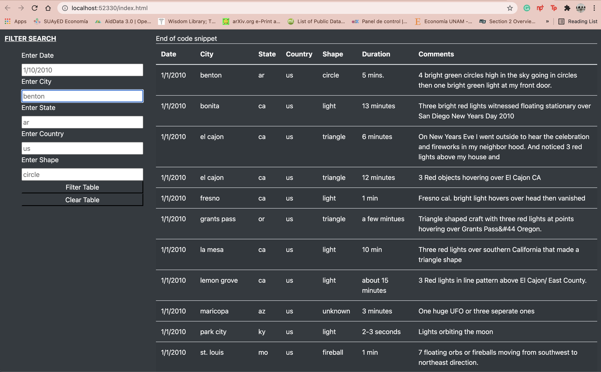

# **UFOs Analysis** :alien:

## Overview of Project ##

This projects shows JavaScript language skills in action. The techinical aspects look into how to apply the field of data analytics and visualization.
The analysis builds and deploys JavaScript functions, including built-in functions; converts JavaScript functions to arrow functions, builds and deploys `forEach` (JavaScript `for loop`), and creates, populates, and dynamically filters a table using JavaScript and HTML.

The resources used for this project are:
- Data Source: [ufo_starterCode.js] and [index.html]
- Data Tools: ECMAScript, JavaScript, Jupyter Notebook, Python and MongoBD.
- Software: ES6+, ECMAScript, MondoDB, Python 3.7.10, and Visual Studio Code Version: 1.56.2 

The main deliverable requires to filter UFO sightings on multiple criteria
Let's check the results.

## Results ## :see_no_evil:

Using JavaScript and HTML, the code will be modified in the index.html file to create more table filters. 
In addition to the date filter was created, there were included additonal filters for the city, state, country, and shape, in order to identify precise results.

## Summary ## :speak_no_evil:

The UFOs website provide information to the user by definig certain criteria.
The link of the website is: http://localhost:52330/index.html

Navigation Bar UFOs' website.

Filter Bars UFOs' website.
